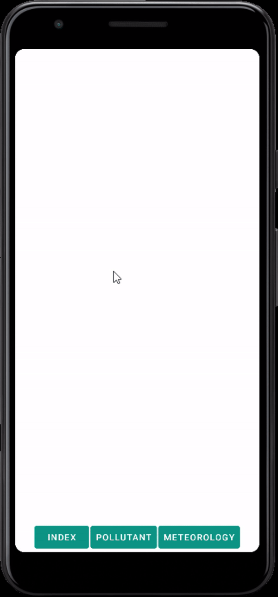

# JsonToApp

JsonReader App in Java, Android Studio.  
The app was built to improve self-knowledge in the field of JSON files. 

## App description:
The app reads a JSON file obtained from a link the user gives to it. 
A button-menu is created(by the first list in the file), clicking each button opens another list-menu(third list in the file), clicking each item on the list opens a legend(second list in the file), all of them connected by id's to know which belongs to who. 
The app is made dynamically, depends on the objects in the JSON file, new buttons may be added(adding a new object to the first list in the file), same as new list items(third list in the file) and new variables to the Legend(second list in the file), connecting each by id's as the objects before. 

## Created with:
* Android studio: Java.
* Android min version: 6
* Android target version: 12
* SDK min version: 23
* SDK target version: 31
